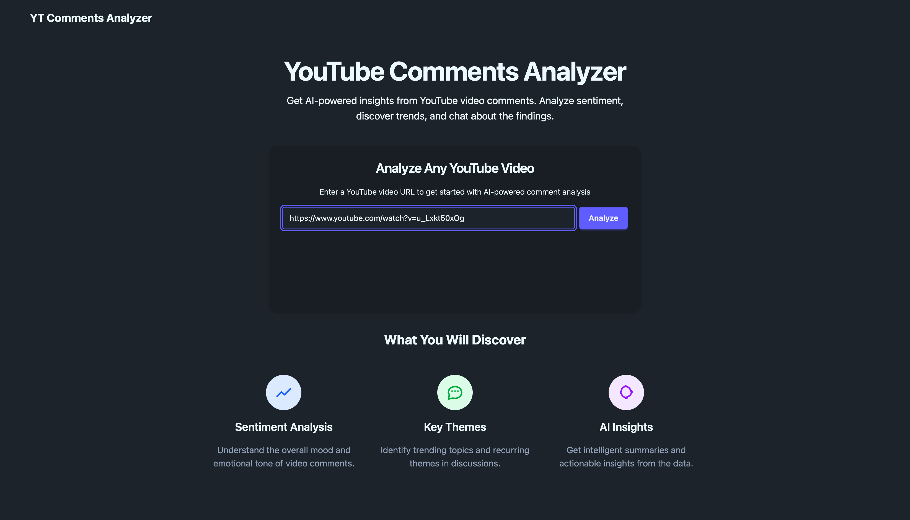
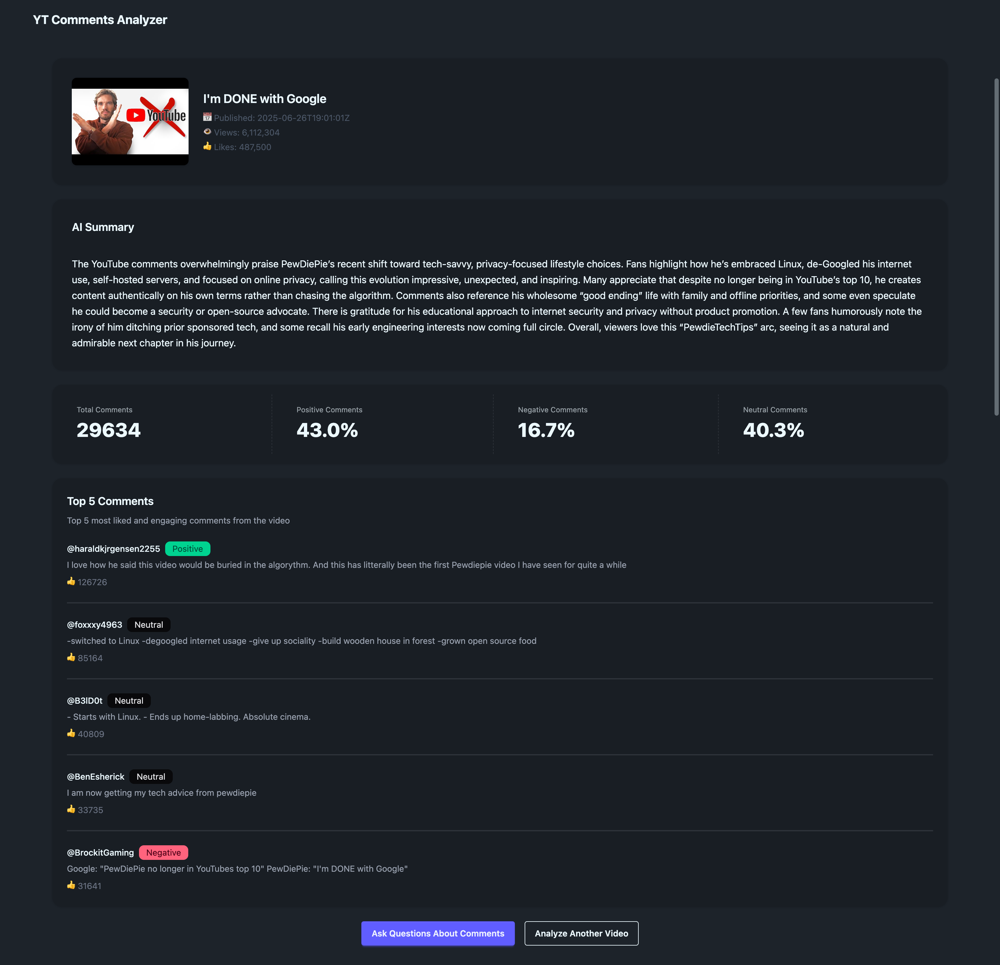
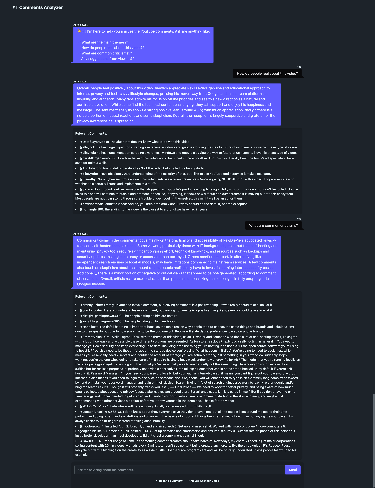

# YouTube Comments AI Analyzer FastAPI App

## Overview

This project is a FastAPI application that summarizes YouTube comments using AI models. It fetches comments from YouTube, summarizes them, vectorizes the comments for similarity search, and allows users to query for specific information.  
**All main endpoints are HTMX endpoints and return rendered HTML templates, not raw JSON.**

## Screenshots

<p align="center">
  
</p>
<p align="center">
  
</p>
<p align="center">
  
</p>

## Setup Instructions

1. **Clone the repository**

   ```bash
   git clone https://github.com/zodakzach/yt-comments-ai-analyzer.git
   cd yt-comments-ai-analyzer
   ```

2. **Create a virtual environment and install dependencies with [uv](https://github.com/astral-sh/uv)**

   ```bash
   uv venv
   source .venv/bin/activate  # On Windows use `.venv\Scripts\activate`
   uv pip install -r pyproject.toml
   ```

3. **Set up environment variables**

   - Copy `.env.example` to `.env` and fill in the required variables:
     - `YOUTUBE_API_KEY`
     - `THREAD_OPENAI_API_KEY`
     - `UPSTASH_REDIS_REST_URL`
     - `UPSTASH_REDIS_REST_TOKEN`

4. **Run the application**

   ```bash
   uvicorn app.main:app --reload
   ```

## Usage

- The API provides HTMX endpoints that return HTML templates:
  - `/summarize/` - Summarize YouTube comments and start a session (returns a summary template).
  - `/question/` - Ask a question about the summarized comments using your session (returns an answer template).
  - `/health` - Health check endpoint

## Contributing

Contributions are welcome! Please open an issue or submit a pull request for any improvements or bug fixes.

## License

This project is licensed under the MIT License. See the LICENSE file for details.
